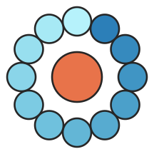

  

# pointcloud.org

A public archive of [Cloud Optimized Point Cloud](https://copc.io) (COPC)
lidar datasets, each with STAC metadata and an in-browser 3D viewer, at
[pointcloud.org](https://pointcloud.org).

This repo holds the dataset manifests that describe what's in the
archive. All ingest, build, and deploy automation lives in
pointcloud.org's own private infrastructure -- this repo is just the
community-facing catalog: anyone can open a PR here to add or edit a
dataset, and never needs credentials for or knowledge of how that
infrastructure works.

## Adding or editing a dataset

See [`manifests/README.md`](manifests/README.md) -- how to structure a
new dataset directory, the full manifest field reference,
endpoint/foreign-bucket handling, derivative-processing overrides, and
worked examples. [`manifests/schema.json`](manifests/schema.json) is
the canonical, machine-readable schema every manifest validates
against in CI.

## License

Manifests describe third-party datasets; each dataset's `license` field
states the terms of the underlying data, which may differ from this
repo's own license.
