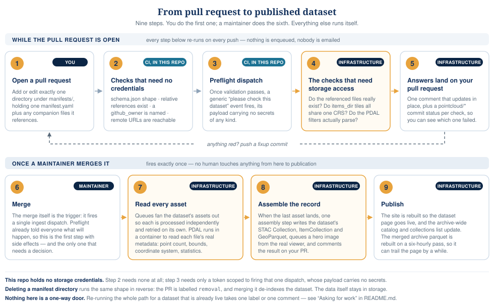

# manifests/

Each directory here is one dataset in the [pointcloud.org](https://pointcloud.org)
archive. `manifests/schema.json` is the canonical, machine-readable
schema for the `manifest.yaml` format below -- every manifest in this
directory validates against it (via `scripts/validate-manifests.mjs`
in CI), and so will yours.

As of schema_version 2 (2026-08), a manifest's own field vocabulary is
aligned directly with [STAC](https://stacspec.org/) -- a manifest reads
as a (partial) STAC Collection, whose `items`/`items_dir`/`stac_item`/
`external_source`/`ept_source` become its child Items at ingest time. Only
pointcloud.org-ingest-specific concerns with no STAC equivalent
(derivatives, federate, viewer settings, ...) live under the nested
`pointcloud_org` object -- everything else is a real, if partial, STAC
Collection field. If you already know STAC, most of this file needs no
legend.

## Adding a dataset

Each pull request may only add or edit **one** dataset directory under
`manifests/` -- CI rejects a PR that touches more than one (with a
comment explaining why), so a broken dataset never blocks review of an
unrelated one sharing the same PR. If you're editing more than one
dataset, open separate PRs.

1. Create a new directory `manifests/<dataset-id>/` (the directory name
   *is* the dataset id -- `id` inside `manifest.yaml` must match it
   exactly, and must be globally unique across this entire repo, even
   across different grouping directories -- see "Grouping datasets into
   directories" below).
2. Add `manifests/<dataset-id>/manifest.yaml` describing it (see
   "Manifest reference" below, and the worked examples further down).
3. If your manifest references any companion files by a relative path
   (a `pdal_filters_file`, a locally-checked-in metadata PDF -- see
   below), put them in that same directory.
4. Open a pull request. CI (`scripts/validate-manifests.mjs`) validates
   your manifest against [`schema.json`](schema.json) plus a few checks
   schema.json can't express on its own (mostly: do the relative-path
   references you gave actually exist on disk), and a separate check
   confirms any foreign/https URL your manifest references is actually
   reachable.
5. Within a minute or two, a bot comment appears on your PR reporting
   the *real* checks against pointcloud.org's own infrastructure --
   see "How ingest actually happens" below. Push a fixup commit and it
   updates in place; you don't need to wait for a merge to find out
   your `items_dir` prefix has a CRS mismatch or a `pdal_filters_file`
   has a typo'd option.
6. Once merged (and every check above is green), ingest starts for
   real.

## Grouping datasets into directories

A dataset directory may be nested one or more levels under an arbitrary
grouping directory, instead of sitting directly under `manifests/` --
e.g. `manifests/usgs-3dep/boston-lot/manifest.yaml` groups `boston-lot`
under `usgs-3dep`, alongside however many other USGS 3DEP datasets get
added the same way. This is purely organizational: `id` is still always
just the leaf directory name (`boston-lot`, not `usgs-3dep/boston-lot`),
globally unique across the whole repo regardless of nesting depth --
grouping doesn't change R2 key prefixes, site routes, or STAC catalog
ids. The grouping segment itself is never authored inside
`manifest.yaml` -- it's derived automatically from the directory path
and surfaced as a `pointcloud_org:group` property on the assembled STAC
Collection.

There's no need to create a grouping directory up front for a single
dataset -- start it directly under `manifests/` (like every existing
dataset today) and only nest it once a second, related dataset shows up.

## How ingest actually happens



This repo holds no ingest credentials at all -- the checks CI can run
directly here (schema shape, do relative-path references exist
locally, is a foreign/https URL reachable) need none, but anything that
actually has to ask pointcloud.org's storage backend something (does
this file exist, do these tiles share a coordinate system, does this
PDAL filter list parse) happens on pointcloud.org's own infrastructure,
which this repo's `.github/workflows/manifest-ingest.yml` reaches by
firing a generic "please check/ingest this dataset" dispatch event --
it holds no credentials for and knows nothing about how that
infrastructure is actually implemented. Two different dispatches fire
from the same workflow:

- **Preflight** (`manifest-preflight`) -- fires on every push to an
  open PR. Read-only: checks that referenced data files exist,
  `items_dir` CRS consistency, and `pdal_filters`/`pdal_filters_file`
  validity, then reports pass/fail straight onto your PR as an
  updating comment plus a `pointcloud/*` commit status per check.
  Never enqueues anything, never emails anyone, however many times you
  push.
- **Ingest** (`manifest-ingest`) -- fires once, when the PR merges.
  Writes the manifest, enqueues real ingest, and posts its own
  outcome comment once the (same) checks resolve for real -- an
  `items_dir` dataset's CRS check is asynchronous and can take a
  while for a large prefix, so this comment may land after the
  workflow run that triggered it has already finished.

If a preflight check ever seems stuck or wrong, look at the
`pointcloud/*` commit statuses on your PR's latest commit (next to the
usual CI checks) -- each one names exactly which check it is
(`pointcloud/file-existence`, `pointcloud/crs-consistency`,
`pointcloud/pdal-filters`).

## Manifest reference

### Required fields

```yaml
schema_version: 2
type: Collection
stac_version: "1.0.0"

id: my-dataset             # must match the directory name, globally unique
title: My Dataset
description: A one-line (or longer) description. May contain Markdown.
license: CC-BY-4.0

providers:                  # at least one; at least one needs a contact
  - name: Some Org
    pointcloud_org:
      contact:               # who gets emailed if ingest preflight fails
        name: Jane Doe
        email: jane@example.org
        github_owner: janedoe   # required: GitHub username, so automation can @-mention you

pointcloud_org:
  derivatives: true          # generate DTM/DSM/ambient-occlusion COGs?

items:                        # see "Describing the data" below
  - id: tile-001
    assets:
      data:
        href: s3://pointcloud/my-dataset/tile-001.copc.laz
        roles: [data]
    pointcloud_org:
      copc_resolution: 1
```

`keywords` (STAC's term for schema_version 1's `tags`) is optional as of
schema_version 2, but still a good idea for search/browse.

### License

`license` is usually a plain identifier -- an [SPDX id](https://spdx.org/licenses/)
for a standard license (`CC0-1.0`, `CC-BY-4.0`, `CC-BY-SA-4.0`, ...) or
an [Open Data Commons](https://opendatacommons.org/licenses/) name for
a data-specific one (`ODC-By-1.0`, `ODbL-1.0`, `ODC-PDDL-1.0`), or
`PUBLICDOMAIN` when nothing more specific applies:

```yaml
license: CC-BY-4.0
```

Use the `{id, url}` object form instead when the license needs an
accompanying terms-of-use link -- e.g. USGS-sourced data, whose
public-domain status is qualified by USGS's own usage FAQ rather than
one canonical license text:

```yaml
license:
  id: "Public Domain (U.S. Government Work)"
  url: https://www.usgs.gov/faqs/what-are-terms-uselicensing-map-services-and-data-national-map
```

`license` becomes the assembled STAC Collection's own `license` field
(`id`, if the object form was used) plus a `rel: license` Link (`url`,
if given) -- the standard STAC way to attach a license URL.

### Describing the data

Exactly one of these four:

- **`items`** -- a hand-authored list, one entry per file, each shaped
  like a minimal STAC Item. Use this when you have a small, fixed
  number of files, or when different files need different `title`/
  `pointcloud_org.copc_resolution` values.
  ```yaml
  items:
    - id: tile-001
      title: Optional per-item title, distinct from the dataset title
      assets:
        data:
          href: s3://pointcloud/my-dataset/tile-001.copc.laz
          roles: [data]
      pointcloud_org:
        copc_resolution: 1
  ```
- **`items_dir`** -- for a batch of many same-CRS files already sitting
  under one prefix in our own bucket (`href` must start with
  `s3://pointcloud/`). Every matching file becomes its own item
  automatically; before real ingest, every one of them is CRS-checked
  to confirm they actually share a coordinate system.
  ```yaml
  items_dir:
    href: s3://pointcloud/my-dataset/
    pattern: "*.copc.laz"   # optional, this is the default
    roles: [data]
    pointcloud_org:
      copc_resolution: 3
  ```
- **`stac_item`** -- a pointer to a contributor's own already-complete
  STAC Item document (geometry, bbox, `pc:*`/`proj:*` properties,
  assets already filled in), instead of retyping that same information
  by hand. Its `assets` map supplies the asset href/type/roles (looking
  for a `"data"`-role asset, falling back to the first asset if none is
  explicitly marked).
  ```yaml
  stac_item:
    href: https://example.org/stac/my-item.json
    pointcloud_org:
      copc_resolution: 1   # optional override; falls back to a conservative default
  ```
- **`external_source`** -- a pointer into someone else's already-published
  STAC Catalog/ItemCollection rather than data we host ourselves, when
  that document's own child Items/Collections should each become their
  own separate pointcloud.org dataset (`expand: true`). As of this
  writing this only produces a dry-run preview report, not a real
  ingest -- see `schema.json`'s description of this field. For a single
  EPT resource (one dataset, not an expand-style catalog of many), use
  `ept_source` below instead.
  ```yaml
  external_source:
    href: https://example.org/some/item_collection.json
    expand: true
  ```
- **`ept_source`** -- a single [Entwine Point Tile](https://entwine.io/entwine-point-tile.html)
  (EPT) resource -- e.g. one project out of USGS 3DEP's EPT catalog --
  read directly via PDAL's `readers.ept` and displayed in-browser via
  Eptium's native EPT support. Never copied into our own bucket (no
  `federate` support) and never converted to COPC, since an EPT
  resource is a multi-file hierarchy (`ept.json` + `ept-data/` +
  `ept-hierarchy/`), not one downloadable file. `href` must end in
  `ept.json` -- that's the exact suffix both PDAL's and Eptium's own
  auto-detection key off of.
  ```yaml
  ept_source:
    href: https://s3-us-west-2.amazonaws.com/usgs-lidar-public/my-project/ept.json
    ept_catalog_id: USGS_LPC_My_Project_2021  # optional; if set, also used to look up
                                               # real start_datetime/end_datetime from
                                               # USGS's WESM CSV at ingest time (an
                                               # ept.json root document has no
                                               # acquisition-date field of its own)
    pointcloud_org:
      copc_resolution: 1   # optional override; falls back to a conservative default
  ```

An individual item's `assets.data.href` can be:
- `s3://pointcloud/...` -- our own bucket.
- `s3://<other-bucket>/...` -- a bucket we don't own. See "Foreign
  buckets and endpoints" below.
- A bare `https://`/`http://` URL.
- A GDAL [Virtual File System](https://gdal.org/en/stable/user/virtual_file_systems.html)
  path (`/vsicurl/...`, `/vsis3/...`, etc.).

### Endpoints: discriminating which S3-compatible service hosts an asset

Every dataset's assets live *somewhere* -- a real AWS S3 bucket,
pointcloud.org's own bucket, someone else's S3-compatible bucket, or
any other S3-compatible service. `assets.data.endpoint` (per-item) and
`pointcloud_org.default_endpoint` (once, for the whole manifest, if
every item shares one bucket/region -- saves repeating it) make that
explicit rather than inferred from the bucket name in `href`:

```yaml
pointcloud_org:
  default_endpoint: https://<account_id>.example-s3-service.com   # this project's own bucket

# or, per item, for a bucket that isn't the default (e.g. someone
# else's S3-compatible bucket):
items:
  - id: tile-001
    assets:
      data:
        href: s3://someone-elses-bucket/tile-001.copc.laz
        endpoint: https://<account_id>.example-s3-service.com
        roles: [data]
    pointcloud_org:
      copc_resolution: 1
```

A real AWS S3 bucket in the default region (`us-east-1`) is the only
case where omitting this is safe -- that's the implicit fallback.
Anything else needs it set (here or via `default_endpoint`), or
resolution will silently produce a broken URL:

- A non-AWS S3-compatible bucket -- ours or anyone else's, including
  this repo's own `s3://pointcloud/...` assets, which every manifest
  sets `default_endpoint` for explicitly, purely so the manifest
  itself states which service+account hosts the data. It has no
  effect on retrieval for `s3://pointcloud/...` specifically -- that's
  always fetched directly by pointcloud.org's own infrastructure,
  never over a public HTTP endpoint.
- An AWS S3 bucket outside the default region -- e.g. USGS 3DEP EPT
  data on `usgs-lidar-public`, which lives in `us-west-2`.

### Optional top-level fields

```yaml
keywords: [some, tags]

links:
  - rel: cite-as
    href: https://doi.org/10.5555/example

extent:
  temporal:
    interval:
      - ["2020-03-01", "2020-09-30"]   # or [null, null]/partial for open-ended

"sci:doi": "10.5555/example"           # bare DOI, not a full URL
"sci:citation": >
  How this dataset itself should be cited. May contain Markdown.
"sci:publications":                     # other publications that used this dataset
  - citation: >
      Doe, J. (2020). A paper that used this dataset.
    doi: "10.5555/other-example"        # optional, per-publication

assets:
  thumbnail:
    href: s3://pointcloud/my-dataset/overview.jpg   # or a bare https:// URL
```

`extent.temporal.interval` is STAC's own shape -- an array of `[start,
end]` pairs, each bound an ISO 8601 date/timestamp or `null` for
open-ended. Unlike schema_version 1's `dataset.temporal.start`/`.end`,
there's no separate bare-date convenience form; a plain `YYYY-MM-DD`
still works (STAC/YAML both treat it as a valid date literal), it's
just written directly in STAC's array shape.

`"sci:doi"`/`"sci:citation"`/`"sci:publications"` are the STAC
[Scientific Citation extension](https://github.com/stac-extensions/scientific)
-- quote the keys in YAML since they contain a colon. `sci:citation` is
separate from `links`' `rel: cite-as` entry: `cite-as` is a single
canonical machine-readable DOI link, while `sci:citation` is
human-readable attribution text (the dataset's own citation) rendered
as-is on the dataset's page; `sci:publications` covers other papers that
used the dataset, distinct from citing the dataset itself.

`assets` is STAC's own Collection-level assets map -- `thumbnail` is the
conventional key for a representative overview image, replacing
schema_version 1's dedicated `overview_image` field with the real STAC
convention for exactly this case. No relative-path support is needed
for it -- it's resolved the same way an item's own `assets.data.href`
is (our bucket / a foreign bucket+endpoint / a bare URL).

### Optional `pointcloud_org` fields

Everything below is pointcloud.org-ingest-specific and has no STAC
equivalent, which is why it's nested under `pointcloud_org` rather than
sitting at the top level alongside the STAC-native fields above.

```yaml
pointcloud_org:
  publication_date: 2021-06-01   # when published, vs. extent.temporal (when acquired)
  viewer:
    default_asset_id: tile-001
  metadata_links:                 # pointers to flight reports, sensor docs, etc.
    - title: Flight report
      href: https://example.org/reports/my-dataset.pdf       # remote, OR:
    - title: Local acquisition notes
      href: acquisition-notes.pdf                             # relative to this manifest's own directory
  federate: true   # copy this dataset's data into pointcloud.org's own storage at ingest time
  acknowledgement: >
    Funding text a data provider asks to be included whenever this
    dataset is used, e.g. a granting agency and award number.
  spatial_reference:
    id: "EPSG:26912"                                   # only when the source metadata states one explicitly
    vertical_id: "EPSG:5703"                            # optional, if documented separately
    url: https://spatialreference.org/ref/epsg/26912/   # only when id resolves to a real reference page
```

`spatial_reference` is purely informational -- it doesn't feed any
ingest-time CRS handling (that comes from the data itself, and from
`items_dir`'s CRS-consistency preflight check). Only set it when the
source metadata for a dataset states an explicit id (an EPSG code is
the common case); don't guess one from the data. Only set `url` when
that id actually resolves to a reference page, e.g.
`https://spatialreference.org/ref/epsg/<code>/` for an EPSG code.

`federate: true` (default false; meaningful alongside a hand-authored
`items` list or a `stac_item` reference -- ignored for `items_dir`/
`external_source`) tells ingest to copy every asset's bytes from
wherever this manifest currently points into pointcloud.org's own
storage once, at ingest time, rather than continuing to read from the
original source on every later access. For a federated `stac_item`
reference, the reference itself is replaced with a materialized `items`
entry pointing at the copy once federation completes. Use `federate`
when a dataset's source host isn't reliably durable long-term (a
personal server, a time-limited hosting arrangement) and the intent is
to actually archive a copy here. A PR whose manifest sets this gets a
`federated` label and a comment calling it out (including an estimated
size, in GB, of what will be copied), since it's a meaningfully
different commitment than the default (link out, don't copy).

A `metadata_links[].href` may be a plain relative filename -- put the
file in `manifests/<dataset-id>/` alongside `manifest.yaml`, and the
site build copies it into its own static output and links to it from
pointcloud.org's own domain.

`description` (top-level, required) accepts the same bare-relative-
`.md`-filename convention as before, for anything longer than a
paragraph or two:

```yaml
description: description.md   # a file in this manifest's own directory
```

### Overriding derivative generation

Only consulted when `pointcloud_org.derivatives: true`. Every field is
optional; omit anything to use the engine's default.

```yaml
pointcloud_org:
  derivative_processing:
    resolution: 1.0   # GSD in meters, overrides each item's copc_resolution for derivatives only, AND bounds the elevation-stats read used for the hero image/viewer's default color range (see below)
    dtm:
      enabled: true
      pdal_filters:                        # inline, OR:
        - type: filters.range
          limits: "Classification[2:2]"
      pdal_filters_file: dtm-filters.json  # a path relative to this manifest's own directory
    dsm:
      enabled: true
    ambient_occlusion:
      enabled: true
```

`pdal_filters`/`pdal_filters_file` are mutually exclusive (pick one).
Either way, only give filter *stages* -- no reader (the engine picks one
based on the source file type) and no writer (the engine always appends
its own `writers.gdal` stage, configured from `resolution`). See
[`hk-2020/manifest.yaml`](hk-2020/manifest.yaml) and its sibling
[`hk-2020/dtm-filters.json`](hk-2020/dtm-filters.json) for a real,
working example of the file form.

## Worked examples

- [`hk-2020/`](hk-2020/) -- `items_dir` (many same-CRS files under one
  prefix), multiple `providers` (producer + separate host), and a
  `pdal_filters_file`.
- [`wi-adams-2019/manifest.yaml`](wi-adams-2019/manifest.yaml) -- a
  hand-authored `items` list with many individually-titled tiles.
- [`barringer-meteorite-crater/manifest.yaml`](barringer-meteorite-crater/manifest.yaml) --
  a minimal single-item manifest with a `links`/`sci:citation`/`sci:doi` entry.

## Removing a dataset

Delete the whole `manifests/<dataset-id>/` directory and open a PR. This
repo automatically detects that the PR removes a dataset (rather than
adding or editing one), labels it `removal`, and posts a comment
explaining what merging it will do -- one dataset per PR applies to a
removal exactly like it does to an addition or edit, so a removal PR
can't be bundled with unrelated changes.

Once merged, the dataset is removed from pointcloud.org's site listing
and from the root STAC Catalog. Its underlying point-cloud data is
**not** deleted -- removing a dataset here only removes it from the
*index* (the site and STAC output), the archived data itself stays in
storage.

## Reingesting a dataset

To re-run ingest for a dataset that's already live -- picking up an
infrastructure-side fix, for example, with no manifest content change
needed -- apply the `reingest` label to the PR that originally
added/updated it (any merged PR under `manifests/<dataset-id>/` works,
not just the very first one). This opens a new, tiny PR that re-touches
that dataset's `manifest.yaml` (a no-op comment line, nothing else
changes) and merges it automatically once checks pass, which re-runs
the same ingest pipeline end to end. A comment gets posted back on the
PR you labeled, linking to the new one. The label removes itself once
processed, so it can be reapplied later for another reingest.

## License

Manifests describe third-party datasets; each dataset's `license` field
states the terms of the underlying data, which may differ from this
repo's own license.
